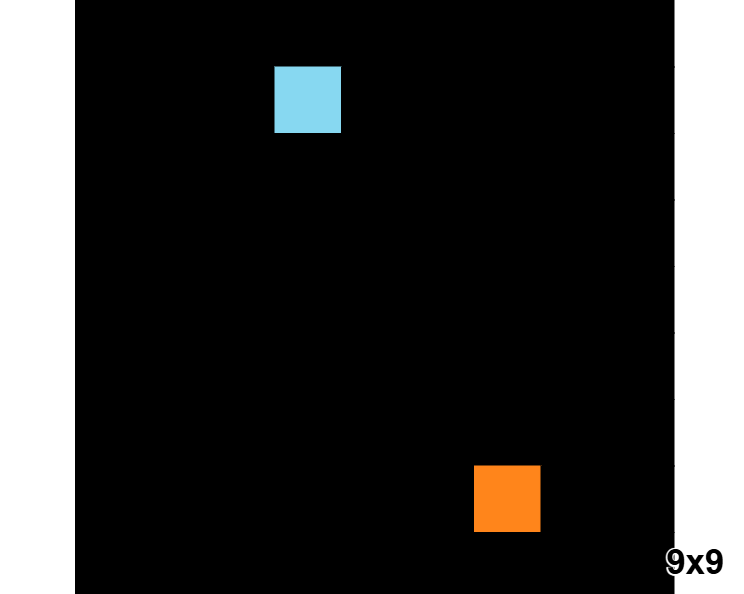
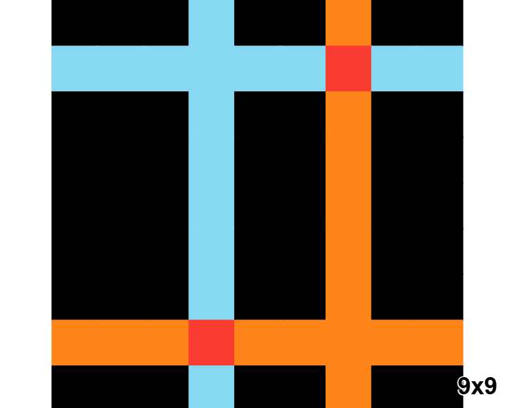
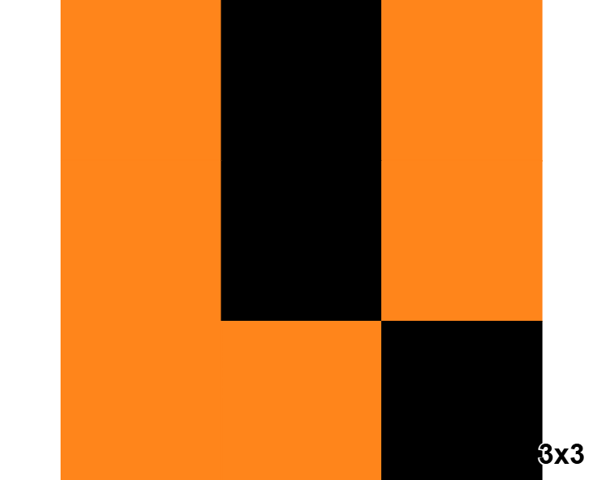
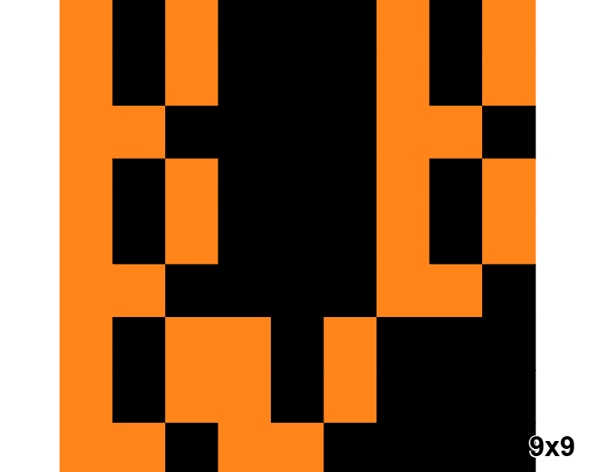
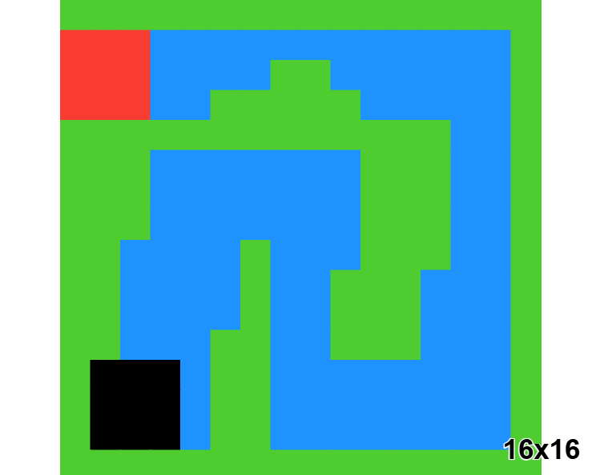
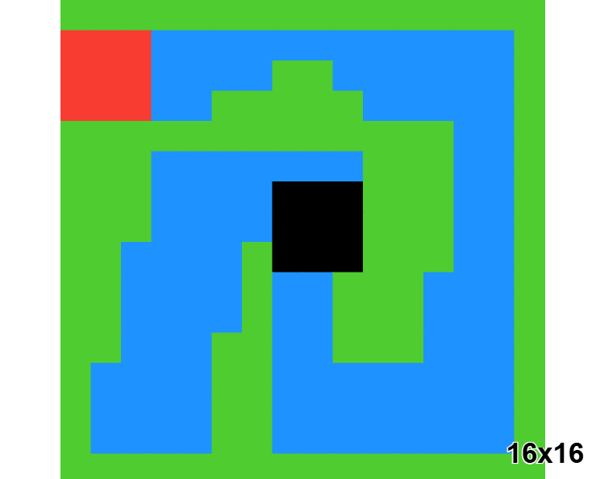
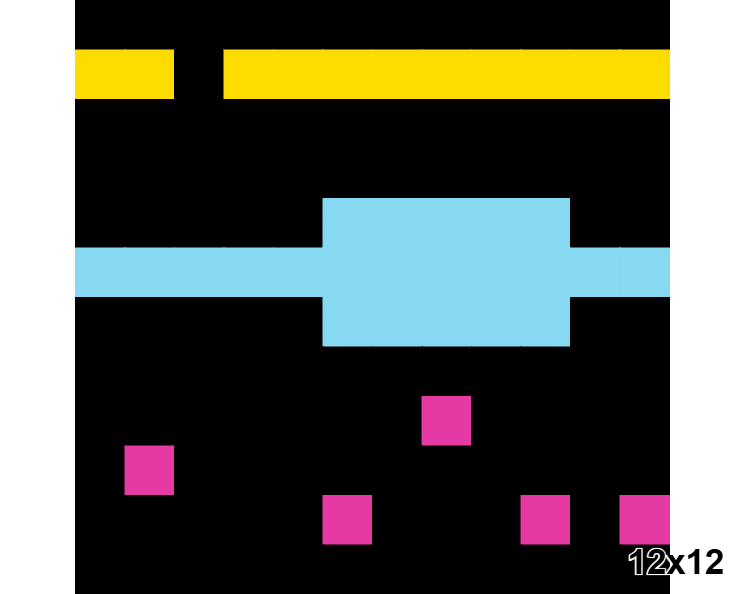

# ARC Prize Challenge Overview

*Note: This document was originally written in French and translated to English for broader accessibility. All content has been reviewed and validated by the research team.*

---

## What is ARC Prize?

The **Abstraction and Reasoning Corpus (ARC) Prize** is a benchmark challenge designed to test artificial general intelligence through visual pattern recognition and logical reasoning. Created by François Chollet, it presents AI systems with grid-based puzzles that require human-like abstract thinking.

**Prize Pool**: $1+ million for achieving human-level performance on private test sets.

## The Challenge Format

### Puzzle Structure

Each ARC task consists of:
- **Training examples**: 1-3 input-output grid pairs showing the transformation rule
- **Test input**: A single grid requiring transformation
- **Goal**: Apply the discovered rule to produce the correct output

### Grid Properties
- **Size**: Variable from 1×1 to 30×30 pixels
- **Colors**: 10 distinct colors (0-9, where 0 = black background)
- **Rules**: Must be learned from examples, not pre-programmed

## Why ARC is Extraordinarily Difficult

### Core Challenges

**Pattern Recognition**: Unlike traditional ML tasks, ARC requires discovering abstract rules from minimal examples.

**Zero-Shot Generalization**: Systems must apply learned rules to novel configurations without additional training.

**Compositional Reasoning**: Many puzzles involve combining multiple simple rules in complex ways.

**Symbolic Abstraction**: Success requires understanding concepts like symmetry, counting, spatial relationships, and object persistence.

## Example Demonstrations

### Basic Transformation

**Puzzle 23581191** - Simple pattern completion:

*Input → Target: Demonstrates fundamental rule learning with clear geometric pattern recognition.*

### Fractal and Self-Similar Patterns

**Puzzle 007bbfb7** - Fractal-like pattern generation:

*Input → Target: Shows recursive pattern generation and self-similar structure understanding.*

### Complex Rule Composition

**Puzzle 332f06d7** - Multi-step logical reasoning:

*Input → Target: Shows compositional reasoning where multiple transformation rules must be applied sequentially.*

### Spatial Reasoning

**Puzzle 1efba499** - Advanced spatial relationship understanding:

*Input → Target: Requires understanding of object relationships, symmetry, and spatial transformation principles.*

## Evaluation Metrics

**Success Criteria**: 
- Must achieve ≥85% accuracy on private test set
- 100% precision requirement (no partial credit)
- Time constraints for practical applicability

**Current State**: 
- Best AI systems: ~30% accuracy (ARC-AGI-2)
- Human performance: 100% accuracy (ARC-AGI-2)
- Significant 70+ point gap remains between AI and human-level reasoning

## ARC Prize Evolution

### ARC Prize 1 (2019-2024)
- Original challenge focusing on 2D spatial reasoning
- Established baseline difficulty and evaluation framework

### ARC Prize 2 (2025)
- Enhanced dataset with additional complexity
- Improved evaluation metrics
- Focus on compositional reasoning

### ARC Prize 3 (Future)
- **Interactive gaming environment**: Transition from static puzzles to video game mechanics
- **Test the games**: [six interactive challenges available](https://three.arcprize.org/) (LS20, AS66, FT09, LP85, SP80, VC33)
- Expected to introduce temporal/sequential reasoning
- Multi-step problem solving with dynamic environments
- Interactive agent-environment challenges

## Why Traditional ML Approaches Struggle

**Data Limitation**: Only 1-3 examples per task vs. millions needed for traditional training

**Rule Discovery**: Must identify abstract patterns, not memorize data distributions

**Precision Requirement**: No tolerance for approximation - solutions must be exactly correct

**Compositional Nature**: Rules must combine flexibly, not just pattern match

## Community and Resources

The ARC Prize has fostered an active research community developing novel approaches to artificial general intelligence through:

- Open datasets and evaluation frameworks
- Collaborative research initiatives  
- Novel visualization and analysis tools
- Alternative reasoning methodologies

---

**Key Insight**: ARC Prize represents a fundamental challenge in AI - moving beyond pattern matching toward genuine understanding and reasoning. Success requires new paradigms that can learn abstract rules from minimal examples and apply them with perfect precision.

**Current Status (ARC Prize 2, 2025)**: 
- **Leading performance**: 29.4% accuracy ([J. Berman - Official Leaderboard](https://arcprize.org/leaderboard))
- **Public leaderboard**: 27.64% accuracy ([Kaggle Competition](https://www.kaggle.com/competitions/arc-prize-2025/leaderboard))
- **Notable results**: 
  - E. Pang: 26.0%
  - Grok 4: 16.0% 
  - Tiny Recursion Model: 6.3% ([arXiv:2511.02886](https://www.arxiv.org/abs/2511.02886))
- **Human baseline**: 100% accuracy (ARC-AGI-2)
- **Prize threshold**: 85%+ required

**Status**: While significant progress has been made, the challenge remains **unsolved** - no system has yet achieved the 85% threshold required for human-level performance, leaving a substantial 55+ point gap that represents one of AI's most important open problems.
