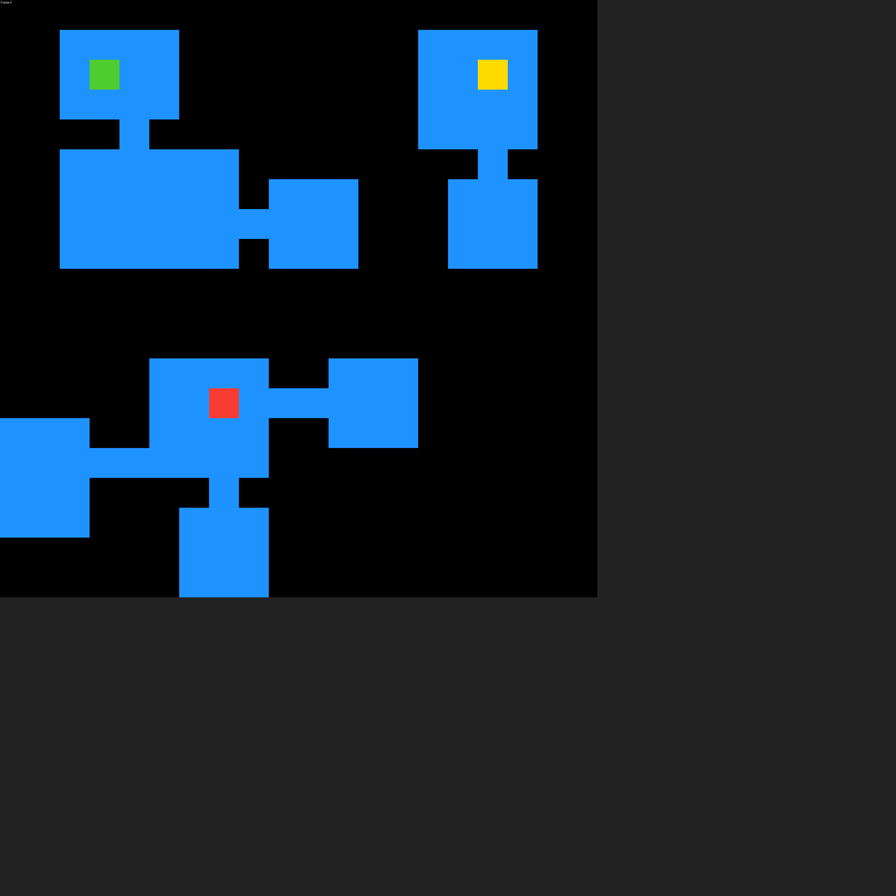
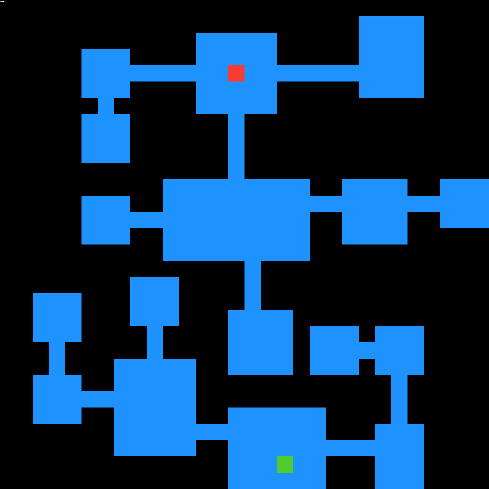
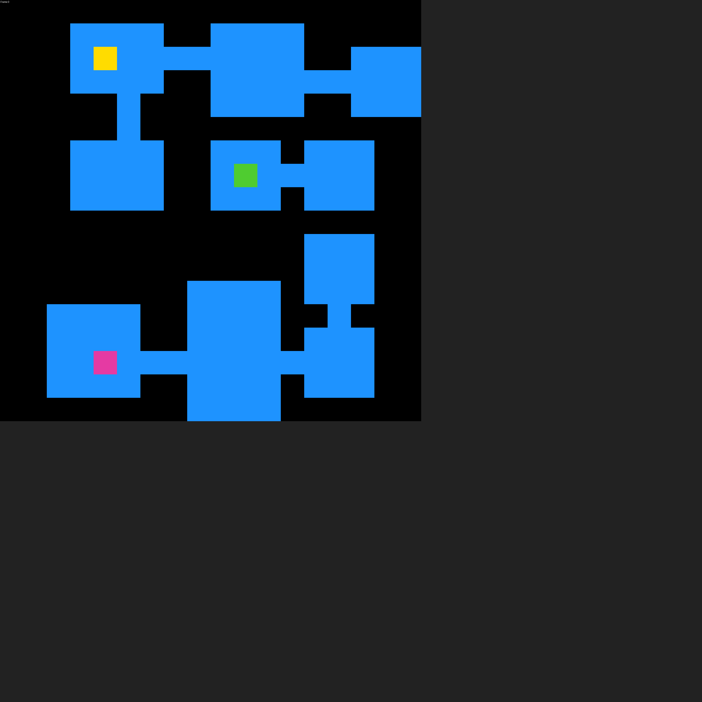
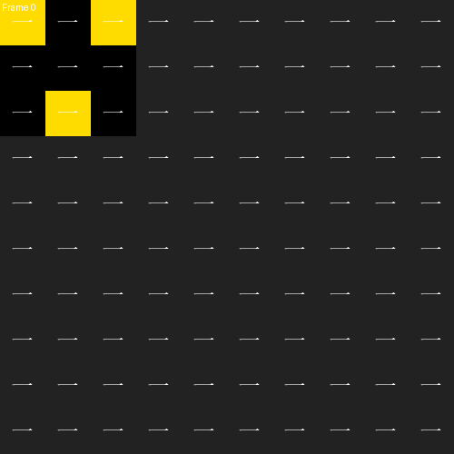
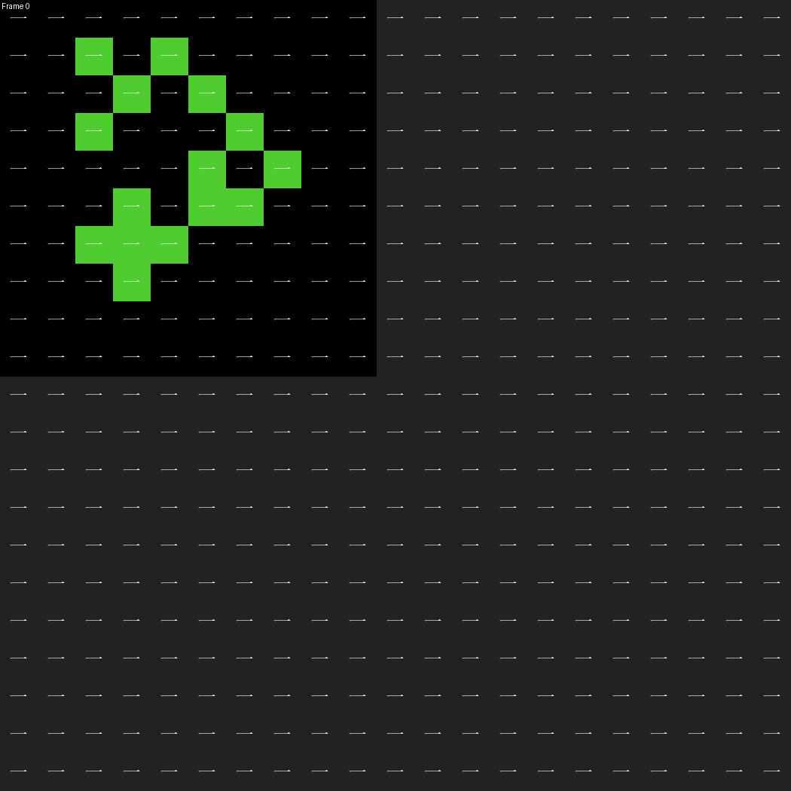
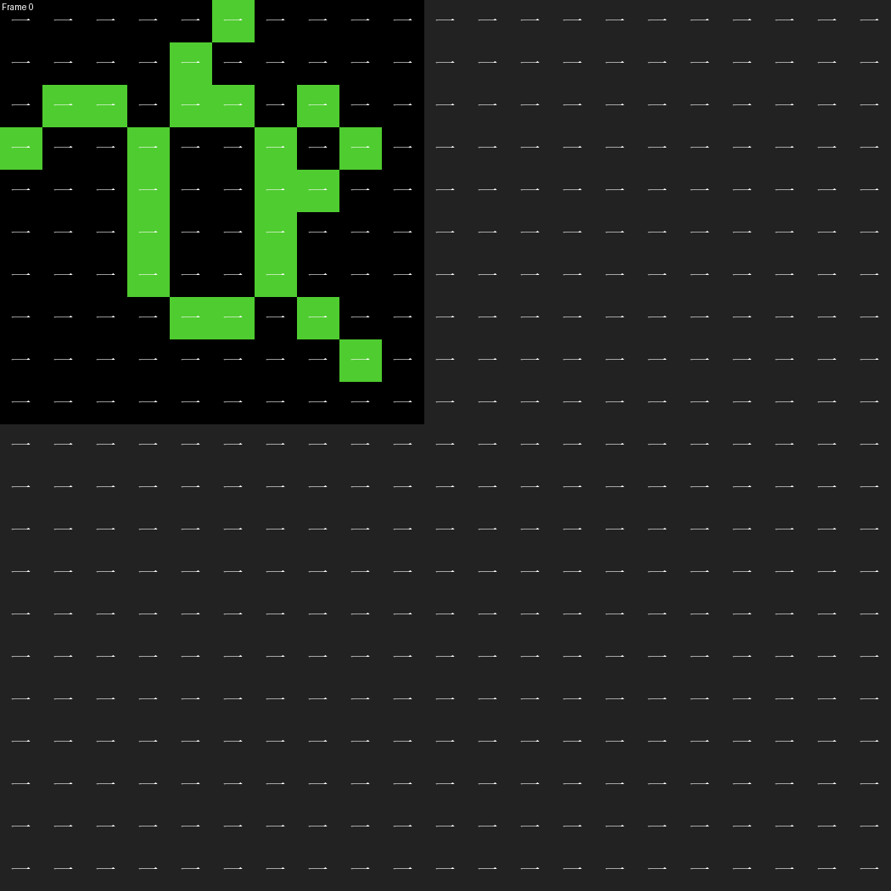
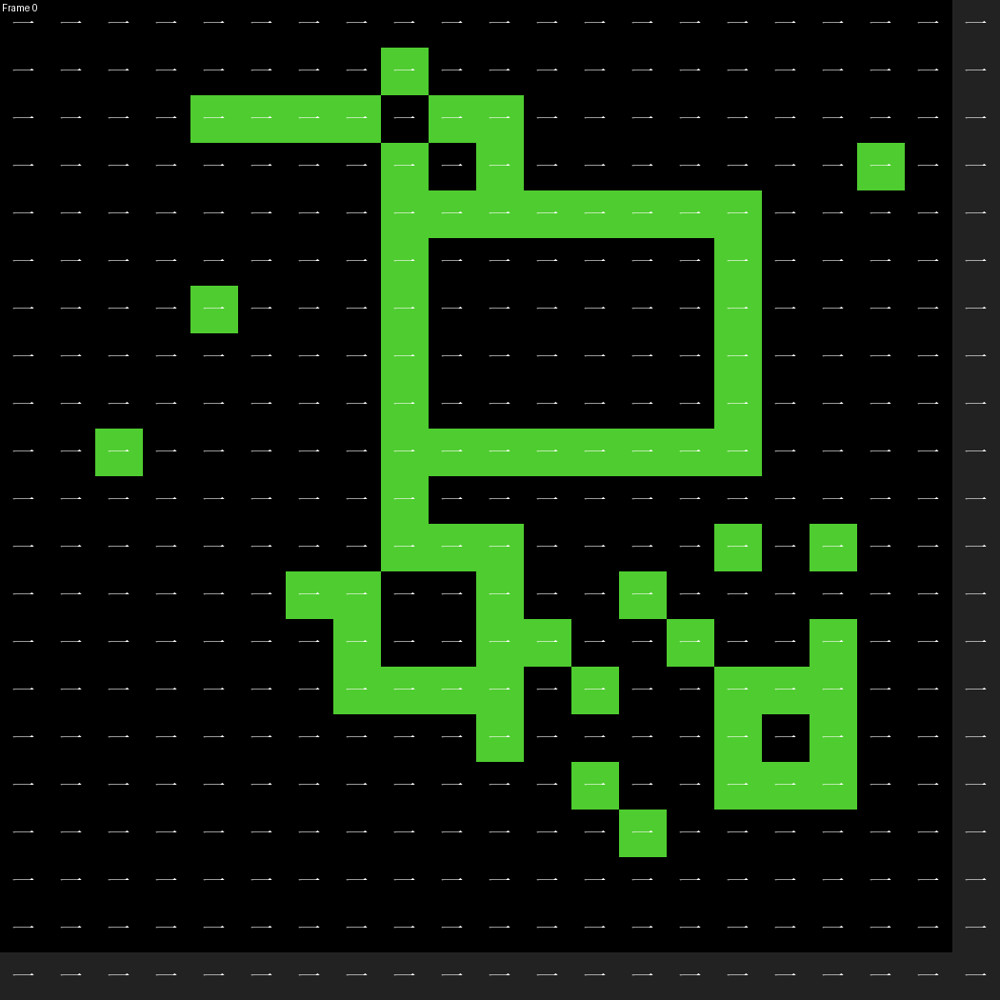
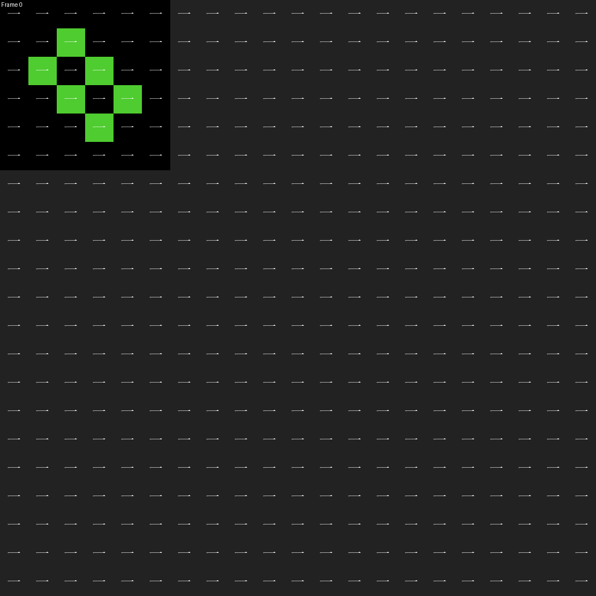

# Pixel Relative Knowledge (PRK) System for ARC Prize

**Historical Approach - PIXMELT Research**

---

## Overview

The Pixel Relative Knowledge (PRK) System introduced a cellular automaton-inspired approach that analyzed local pixel environments to determine transformation priorities. This classical algorithm produces reproducible results through deterministic rule application.

## Core Algorithm

```python
def get_pixel_attention_optimized(
    inputs: torch.Tensor,  # shape: [?, 30, 30], integers [0;10]
    markers: torch.Tensor,  # shape: [?, 30, 30], floatting [0;1]
    targets: torch.Tensor,  # shape: [?, 30, 30], integers [0;10]
    fill: float = 10.0
):
    states = torch.arange(0, 5, dtype=torch.float32, device=inputs.device) / 4.0
    batch_size, height, width = inputs.shape
    
    # Padding to handle borders
    inputs_pad = F.pad(inputs.float(), (1, 1, 1, 1), value=fill)
    markers_pad = F.pad(markers, (1, 1, 1, 1), value=0.0)
    
    # Extract 3x3 neighborhoods vectorized
    inputs_near = inputs_pad.unfold(1, 3, 1).unfold(2, 3, 1)  # [batch, H, W, 3, 3]
    markers_near = markers_pad.unfold(1, 3, 1).unfold(2, 3, 1)  # [batch, H, W, 3, 3]
    
    # Reshape for easier processing
    inputs_flat = inputs_near.reshape(batch_size, height, width, 9)
    markers_flat = markers_near.reshape(batch_size, height, width, 9)
    
    # Initialize result with state[4] (default case)
    result = torch.full_like(inputs, states[4], dtype=torch.float32)
    
    # Calculate pixel_match for all pixels
    pixel_match = (targets != inputs)
    
    # Get pixel values and flatten everything for vectorized processing
    pixel_values = inputs.flatten()
    pixel_match_flat = pixel_match.flatten()
    inputs_flat_reshaped = inputs_flat.reshape(-1, 9)
    markers_flat_reshaped = markers_flat.reshape(-1, 9)

    # Calculate diversity for inputs
    is_filled = torch.zeros(inputs_flat_reshaped.size(0), dtype=torch.bool, device=inputs.device)
    input_diversity = torch.zeros(inputs_flat_reshaped.size(0), device=inputs.device)
    for i in range(inputs_flat_reshaped.size(0)):
        unique_inputs = torch.unique(inputs_flat_reshaped[i])
        diversity = len(unique_inputs)
        if fill in unique_inputs:
            if diversity < 3: diversity -= 1
            is_filled[i] = True
        input_diversity[i] = diversity
    
    # Calculate marker diversity
    marker_diversity = torch.zeros(markers_flat_reshaped.size(0), device=inputs.device)
    for i in range(markers_flat_reshaped.size(0)):
        unique_markers = torch.unique(markers_flat_reshaped[i])
        diversity = len(unique_markers)
        if is_filled[i]:
            if diversity < 3: diversity -= 1
            diversity -= 1
        marker_diversity[i] = diversity
    
    # Apply rules for input_diversity
    input_result_flat = torch.full_like(pixel_values, 4, dtype=torch.long)  # Default state index 4

    # Input diversity rules (unchanged)
    fill_mask = (pixel_values == fill)
    # Rule 1: value == fill
    input_result_flat[fill_mask & ~pixel_match_flat] = 0  # fill and not pixel_match -> state[0]
    input_result_flat[fill_mask & pixel_match_flat] = 1   # fill and pixel_match -> state[1]

    # Rule 2: diversity == 1 (and not fill)
    div1_mask = (input_diversity == 1) & ~fill_mask
    input_result_flat[div1_mask & ~pixel_match_flat] = 1  # div1 and not pixel_match -> state[1]
    input_result_flat[div1_mask & pixel_match_flat] = 2   # div1 and pixel_match -> state[2]

    # Rule 3: diversity == 2 (and not fill)
    div2_mask = (input_diversity == 2) & ~fill_mask
    input_result_flat[div2_mask & ~pixel_match_flat] = 2  # div2 and not pixel_match -> state[2]
    input_result_flat[div2_mask & pixel_match_flat] = 3   # div2 and pixel_match -> state[3]

    # Rule 4: diversity >= 3 and not pixel_match (and not fill)
    div3_mask = (input_diversity >= 3) & ~fill_mask & ~pixel_match_flat
    input_result_flat[div3_mask] = 3

    # Apply rules for marker_diversity (without fill_mask condition)
    marker_result_flat = torch.full_like(pixel_values, 4, dtype=torch.long)  # Default state index 4

    # Rule 1: diversity == 1 (no fill condition)
    mdiv1_mask = (marker_diversity == 1)
    marker_result_flat[mdiv1_mask & ~pixel_match_flat] = 1  # div1 and not pixel_match -> state[1]
    marker_result_flat[mdiv1_mask & pixel_match_flat] = 2   # div1 and pixel_match -> state[2]

    # Rule 2: diversity == 2
    mdiv2_mask = (marker_diversity == 2)
    marker_result_flat[mdiv2_mask & ~pixel_match_flat] = 2  # div2 and not pixel_match -> state[2]
    marker_result_flat[mdiv2_mask & pixel_match_flat] = 3   # div2 and pixel_match -> state[3]

    # Rule 3: diversity == 3 and not pixel_match
    mdiv3_mask = (marker_diversity == 3) & ~pixel_match_flat
    marker_result_flat[mdiv3_mask] = 3

    # Take the maximum of both rule results
    final_state_indices = torch.max(input_result_flat, marker_result_flat)

    # Convert indices to actual state values
    result_flat = states[final_state_indices]

    # Reshape back to original dimensions
    result = result_flat.reshape(batch_size, height, width)

    return result, inputs_flat, markers_flat
```

## Framework Integration

The PRK system operates within a broader framework using step-by-step analysis and deterministic pattern labeling:

```python
def pattern_to_seed(pattern):
    pattern_bytes = pattern.cpu().numpy().tobytes()
    hash_obj = hashlib.md5(pattern_bytes)
    seed = int(hash_obj.hexdigest()[:8], 16)
    return seed
def pattern_to_id(pattern):
    if torch.max(pattern) == 0.0: return 0
    # Best rotation
    rotations = torch.cat([
        rotate_3x3(pattern, rotate).unsqueeze(0)
        for rotate in ['left','flip','right']
    ], dim=0)
    weights = torch.arange(1, pattern.size(-1)+1, dtype=pattern.dtype, device=pattern.device)
    weighted_sums = torch.sum(rotations * weights, dim=1)
    best_one = rotations[torch.argmax(weighted_sums)]
    # Generate
    gen = torch.Generator()
    gen.manual_seed(pattern_to_seed(best_one))
    return torch.rand(1, generator=gen).item()

def get_vcnn_steps(
    inputs:torch.Tensor,
    targets:torch.Tensor,
    max_steps:int = 1000,
    num_classes:int = 11, # recommended
    max_patterns:int = 200,
    echo:callable = print
):
    echo('🔬 Analyze step by step')
    steps, top_size = [], 0
    x = inputs.detach().clone() # Clone Values layer
    markers = torch.zeros(*x.shape, device=inputs.device) # Add Marker layer
    # Snapshot
    def snapshot():
        nonlocal steps
        mlayers = GradLinSolver.get_mlayer(x, num_classes) # Values [0-10]
        mlayers = torch.cat([ mlayers, markers.unsqueeze(1) ], dim=1)
        steps.append(mlayers.unsqueeze(0))
        # Show distance
        dist = int(torch.sum(torch.clamp(torch.abs(targets - x), max=1.0)))
        echo(f'🦤 top_size: {top_size} | dist: {dist:.2f}')
    snapshot()
    # Analyze
    try:
        for istep in range(max_steps):
            echo(f'🍪 {istep+1}/{max_steps}')
            top_size_stack = []
            # Get a pixel attention
            attention, inputs_near, markers_near = get_pixel_attention_optimized(
                x, markers, targets, num_classes-1)
            # Intensity
            intensity_hits = attention.clone()
            intensity = torch.max(intensity_hits)
            def update_intensity():
                nonlocal intensity, intensity_hits
                intensity_hits = torch.where(intensity_hits >= intensity, 0, intensity_hits)
                intensity = torch.max(intensity_hits)
            # Find patterns and confirm them
            def find_patterns(
                attention:torch.Tensor,
                near:torch.Tensor,
                no_empty:bool=False
            ):
                mask = (attention == 1.0).unsqueeze(-1).expand_as(near)
                patterns = near[mask].reshape(-1, near.size(-1))
                patterns = torch.unique(patterns, dim=0)
                if no_empty: return patterns[(patterns != 0).any(dim=1)]
                return patterns
            def check_patterns(
                attention: torch.Tensor,
                near: torch.Tensor,
                patterns: torch.Tensor
            ):
                if len(patterns) == 0: return (attention == attention)
                near_expanded = near.unsqueeze(-2)  # [4, 4, 4, 1, 9]
                patterns_expanded = patterns.view(1, 1, 1, *patterns.shape)  # [1, 1, 1, 2, 9]
                matches = torch.all(near_expanded == patterns_expanded, dim=-1)  # [4, 4, 4, 2]
                return matches.any(-1)
            if intensity == 1.0:
                mask_on = (attention == 1.0)
                # Find the patterns
                in_patterns = find_patterns(attention, inputs_near)[:max_patterns]
                mks_patterns = find_patterns(attention, markers_near, True)[:max_patterns]
                # Confirm the patterns
                in_checked = check_patterns(attention, inputs_near, in_patterns)
                mks_checked = check_patterns(attention, markers_near, mks_patterns)
                # Checklist
                full_checked = torch.cat([
                    mask_on.unsqueeze(-1),
                    in_checked.unsqueeze(-1),
                    mks_checked.unsqueeze(-1)
                ], dim=-1).all(-1)
                # Update
                if full_checked.any():
                    # full_checked &= (markers > 0.0)
                    x = torch.where(full_checked, targets, x)
                    top_size_stack.append(full_checked.size(0))
                # Recalculate intensity
                update_intensity()
            # Add markers
            mks_reset = False
            count_markers = 0
            while count_markers == 0:
                mks_alter = (attention == intensity) & (markers == 0.0)
                echo(f'🦤 intensity: {float(intensity):.2f}')
                if not mks_alter.any():
                    update_intensity()
                    if intensity == 0.0:
                        # Secure rule: no infinite loop
                        if mks_reset or count_markers > 0: break
                        # Reset the markers
                        intensity_hits = attention.clone()
                        intensity = torch.max(intensity_hits)
                        if intensity == 1.0:
                            update_intensity()
                        markers = torch.zeros(*x.shape, device=inputs.device)
                        echo(f'😅 Reset markers\n')
                        mks_reset = True
                if mks_alter.any():
                    # Normalize to get the best relations
                    diffuse = torch.where(mks_alter.unsqueeze(-1), inputs_near, 0.0)
                    # diffuse = torch.sort(diffuse, dim=-1)[0]
                    # Identify the unique patterns
                    diffuse_patterns = torch.unique(diffuse.view(-1, diffuse.size(-1)), dim=0)
                    # diffuse_patterns = diffuse_patterns[torch.randperm(diffuse_patterns.size(0))][:max_patterns]
                    # Add zeros entry if required
                    if not torch.any(torch.all(diffuse_patterns == 0, dim=-1)):
                        diffuse_patterns = torch.cat([
                            torch.zeros(
                                1, diffuse_patterns.size(-1),
                                device=diffuse_patterns.device
                            ),
                            diffuse_patterns
                        ], dim=0)
                    # Generate the ids
                    diffuse_ids = torch.tensor([
                        pattern_to_id(pattern)
                        for index, pattern in enumerate(diffuse_patterns)
                    ], device=diffuse_patterns.device)
                    top_size_stack.append(diffuse_ids.size(0)-1)
                    # Transform patterns into ids
                    grid_flat = diffuse.view(-1, diffuse.size(-1))
                    matches = torch.all(grid_flat.unsqueeze(1) == diffuse_patterns.unsqueeze(0), dim=-1)
                    pattern_indices = torch.argmax(matches.float(), dim=-1)
                    diffuse_mapped = diffuse_ids[pattern_indices].view(diffuse.shape[:-1])
                    # Update
                    count_markers = (torch.amax(diffuse_mapped, dim=-1).flatten() > 0.0).sum()
                    echo(f'🦤 markers: +{count_markers}')
                    markers = torch.where(diffuse_mapped > 0.0, diffuse_mapped, markers)
                update_intensity()
            top_size = max([top_size, sum(top_size_stack) ])
            # Save the state
            snapshot()
            echo('')
            # Auto-Stop
            if torch.equal(x, targets): break
    except KeyboardInterrupt:
        echo("😅 Training stopped by user\n")
    steps = torch.cat(steps, dim=0)
    # Return the steps and top_size
    return steps, top_size
```

## PRK State Classification System

- **State 0.0**: No change + low diversity (< 2 unique values)
- **State 1.0**: No change + high diversity (≥ 2 unique values)  
- **State 2.0**: Has change + center pixel unchanged
- **State 3.0**: Has change + center changed + low diversity
- **State 4.0**: Has change + center changed + high diversity

## Architecture Design

The PRK system operated on a multi-layered representation:
- X binary one-hot layers (10 classes)
- Annotation layer for change propagation
- PRK analysis layer

Multiple expert modules (simple linear transformations using CNN2D structure) sequentially processed these layers to propagate changes from "hot zones" (high PRK diversity areas).

## Demonstration Results

### Version 1 - Initial Direct Drawing Approach

**Puzzle ID: 09c534e7**





*Initial cellular automaton-based transformation showing hot zone identification without propagation system.*

### Version 2 - First Propagation Implementation

**Puzzle ID: 007bbfb7**  


**Puzzle ID: 00d62c1b**  






*Step-by-step evolution showing first propagation mechanisms with scaling issues and localized losses across different image regions.*

## Cellular Automaton Inspiration

This approach drew from cellular automaton principles, where local updates propagate globally, creating emergent behaviors suitable for pattern transformation tasks.

## Deterministic Nature

**PRK is a classical algorithm that produces reproducible results**. Unlike machine learning approaches that may rely on random chance, PRK's deterministic nature ensures consistent outcomes across multiple runs, making it highly reliable for pattern transformation tasks.

## Version 3 Developments

In the development of PRK v3, Chinese characters were adopted for visualization purposes instead of emojis due to GIF generation compatibility issues. These characters serve purely as symbolic representations and provide sufficient visual diversity within single character constraints to effectively display the various PRK states and transformations. Version 3 achieved correct annotation movement, though processing time may occasionally be extended for complex patterns.

## Strengths

- Excellent at identifying transformation priority zones
- Natural propagation mechanism for changes
- Robust local environment analysis
- Deterministic and reproducible results
- Classical algorithm approach ensuring stability

## Limitations

- Limited ability to abstract beyond training examples
- Difficulty in handling novel rule combinations
- Insufficient representation of meta-rules governing transformations
- Scaling constraints in version 2 implementation

## Legacy Impact

The PRK system provided valuable insights into cellular automaton-based approaches for pattern transformation, particularly in understanding local environment analysis and propagation mechanisms. These insights contributed to the development of more sophisticated representation systems.

---

**Research Status**: Archived - Superseded by Flat Space Representation approach

**Contact**: PIXMELT Research Team
