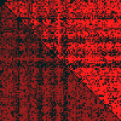
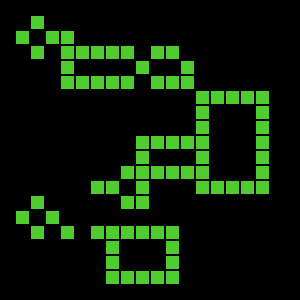
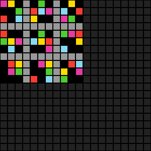
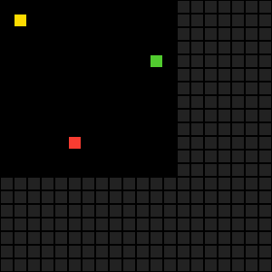
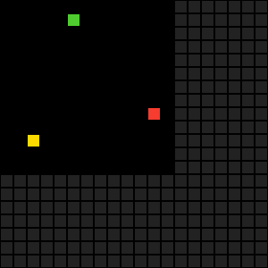
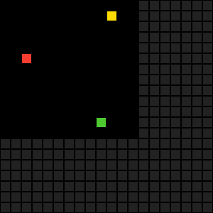
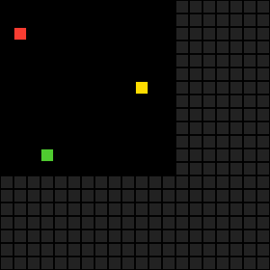
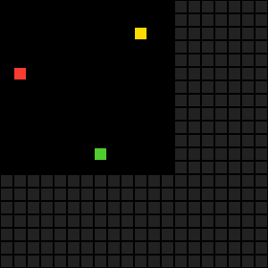

# Flat Space Representation for ARC Prize Solver: A Novel Approach

**Research conducted by PIXMELT**

---

## Abstract

This research paper presents a novel approach to solving ARC (Abstraction and Reasoning Corpus) Prize challenges through a "flat space" representation system. We propose a binary tensor-based methodology that converts 2D grid problems into 1D representations, enabling more efficient pattern recognition and rule discovery. This approach addresses key challenges in current ARC solving methodologies, including scaling issues, rule representation, and generalization problems.

## 1. Introduction

The ARC Prize represents one of the most challenging benchmarks in artificial intelligence, requiring systems to demonstrate human-like reasoning capabilities through visual pattern recognition and rule application. Current approaches have struggled with fundamental issues including inconsistent scaling across different grid sizes, inadequate rule representation systems, and poor generalization capabilities.

This paper introduces the "flat space" representation system, a binary tensor approach that standardizes grid representation and enables more efficient pattern detection and rule application mechanisms.

## 2. The Flat Space Representation System

### 2.1 Core Concept

The flat space representation transforms traditional 2D grid problems into a standardized 1D binary tensor format. The system operates on the following principles:

- **Fixed Grid Size**: All grids are normalized to a 30x30 format, eliminating scaling inconsistencies
- **One-Hot Encoding**: Each grid position is represented using 10-class one-hot encoding
- **Binary Tensor Structure**: The resulting tensor has dimensions 30 × 30 × 10 = 9,000 binary values (0|1)

### 2.2 Advantages of Fixed Dimensionality

By establishing a fixed 30x30 grid size, the system eliminates several critical problems:

1. **Scaling Issues**: No need for dynamic resizing algorithms that can introduce artifacts
2. **Classification Boundaries**: Out-of-bounds areas are naturally represented as zero vectors across all 10 classes
3. **Computational Consistency**: All operations work on uniform tensor sizes, enabling optimized processing

### 2.3 Binary Representation Benefits

The binary nature of the representation offers computational advantages:
- Efficient bitwise operations for pattern matching
- Reduced memory footprint compared to floating-point representations
- Direct application of logical operations for rule verification

## 3. Pattern Recognition Through Zone Grouping

### 3.1 Spatial Grouping Strategies

The flat space representation enables systematic grouping of tensor regions:

- **Column-wise Analysis**: Vertical pattern detection through column tensor slicing
- **Row-wise Analysis**: Horizontal pattern detection through row tensor slicing
- **Diagonal Analysis**: Diagonal pattern recognition using tensor diagonal extraction
- **Arbitrary Shape Analysis**: Custom shape pattern detection through flexible tensor masking

### 3.2 Efficient Pattern Matching

Pattern identification becomes computationally efficient through:
- **Difference Calculation**: Using abs() operations after input-target subtraction
- **Interest Zone Identification**: Rapid detection of non-zero regions indicating pattern differences
- **Binary Logic Operations**: Direct application of AND, OR, XOR operations for pattern comparison

## 4. Rule Representation and Transformation Challenges

### 4.1 Current Limitations

Existing approaches lack effective representation systems for:
- Analysis rules that identify patterns
- Transformation rules that modify patterns
- Relationship calculations between different pattern elements
- Group-based transformations affecting multiple grid regions

### 4.2 Proposed Solution Framework

We propose developing a model capable of:
- **Rule Generation**: Creating simple transformation rules from training data
- **Rule Discovery**: Learning to identify and apply discovered rules
- **Rule Application**: Executing transformations on grouped tensor regions

The critical challenge lies in avoiding exhaustive rule enumeration that leads to:
- Specialized datasets with limited generalization
- Excessive human interaction requirements
- Reduced algorithmic research focus

## 5. Multi-Expert and Bayesian Approaches

### 5.1 Bayesian Model Integration

A Bayesian framework could provide:
- Probabilistic rule confidence assessment
- Multi-expert consensus mechanisms
- Uncertainty quantification for rule application

### 5.2 Transformer vs. Genetic Algorithm Considerations

While Transformer blocks remain SOTA in 2025, we argue for exploring:
- **Genetic Algorithms**: Operating on smaller models with evolutionary parameter optimization
- **Alternative Optimization**: Moving beyond traditional optimizers like AdamW
- **Ensemble Methods**: Combining multiple smaller models rather than scaling single large models

The rationale centers on the discrete nature of ARC problems, which may benefit from evolutionary rather than gradient-based approaches.

## 6. Historical Challenges and Lessons Learned

### 6.1 Previous Experimental Approaches

Before developing the flat space representation, two distinct approaches were explored, each providing valuable insights into ARC solving methodologies while revealing fundamental limitations.

#### 6.1.1 Distance-Based Attention System (GradLinExpert)

The first approach implemented a novel attention mechanism based on spatial distances between grid positions. The system operated through multiple agents that progressively transformed inputs by adding transformation layers.

**Core Architecture:**

```python
class GradLinExpert(nn.Module):
    VERSION = '1.0.0'
    def __init__(
        self,
        lsize:int = 9,
        num_classes:int = 11,
    ):
        super().__init__()
        self.params = [ lsize, num_classes ]
        # Props
        self.register_buffer('lsize', torch.tensor(lsize, dtype=torch.int))
        self.register_buffer('num_classes', torch.tensor(num_classes, dtype=torch.long))
        # Weights
        self.encoder = nn.Parameter(torch.ones(lsize, num_classes))
        self.attention = nn.Parameter(torch.rand(lsize * (lsize - 1) // 2) * (num_classes-1))
        self.decoder = nn.Parameter(torch.ones(lsize * (lsize - 1) // 2, num_classes))
        # Caches
        self.attention_pos = self.get_pairwise_positions(lsize)

    def forward(self, inputs):
        e_min = 1e-8
        self.attention_pos = self.attention_pos.to(inputs.device)

        # Encoder
        encoded_values = inputs * self.encoder

        # Attention
        def compute_distance(a, b, c):
            return torch.sqrt((a-b)**2 + (a-c)**2 + e_min)
        attention = compute_distance(
            self.attention[:, None], # Target
            encoded_values[:, self.attention_pos[:, 0]], # Left
            encoded_values[:, self.attention_pos[:, 1]], # Right
        )
        at_max = torch.amax(attention, dim=(1, 2), keepdim=True)
        attention = attention / (at_max + e_min)
        attention.neg_().add_(1)

        # Decoder
        attention.mul_(self.decoder)

        # Projection
        projection = torch.zeros(inputs.shape[0], self.lsize, self.num_classes, device=inputs.device)
        projection.scatter_add_(1, self.attention_pos[None, :, 0, None].expand(attention.shape), attention)
        projection.scatter_add_(1, self.attention_pos[None, :, 1, None].expand(attention.shape), attention)
        pj_max = torch.amax(projection, dim=(1, 2), keepdim=True)
        projection = projection / (pj_max + e_min)
        return projection
```

**Key Mechanisms:**

1. **Distance-Based Attention Formula**: The attention mechanism computes distances between coupled values using:
   ```
   distance = sqrt((target - left)² + (target - right)² + ε)
   ```
   where positions are paired systematically (e.g., for 2×2 grid: (0,0)↔(1,0), (0,0)↔(0,1), (0,0)↔(1,1), then (1,0)↔(0,1), etc.)

2. **Layer Calculation Formula**: The number of transformation layers was determined by:
   ```
   layers = 0.4 × distance_max
   ```
   where distance_max represents the maximum number of pixel changes between input and target grids.

**Limitations**: While this approach successfully reproduced certain complex ARC rules, it failed to generalize beyond training examples, suggesting that distance-based attention alone was insufficient for abstract reasoning.

**Demonstration Examples:**


*Figure 1: Attention heat map visualization showing the distance-based attention mechanism in action. Brighter areas indicate higher attention values between coupled grid positions.*

**Version 2 Results:**
- Puzzle ID: 00d62c1b
  
  *Figure 2: Progressive transformation using distance-based attention for puzzle 00d62c1b.*

- Puzzle ID: 09629e4f
  
  *Figure 3: Transformation sequence for puzzle 09629e4f showing layer-by-layer processing.*

**Version 3 Results:**
- Puzzle ID: 0e671a1a (Multiple examples and test case)
  
  
  *Figure 4: Example 0 - Initial pattern recognition and transformation initiation.*
  
  
  *Figure 5: Example 1 - Intermediate transformation steps with attention refinement.*
  
  
  *Figure 6: Example 2 - Complex pattern handling with multiple attention layers.*
  
  
  *Figure 7: Example 3 - Final training example showing convergence behavior.*
  
  
  *Figure 8: Test case application demonstrating the model's attempt to generalize learned patterns.*

#### 6.1.2 Pixel Relative Knowledge (PRK) System

The second approach introduced a cellular automaton-inspired system that analyzed local pixel environments to determine transformation priorities.

**Core PRK Algorithm:**

```python
def get_prk_view_differentiable(inputs, fill=10.0):
    """Fully differentiable version that matches original logic 100%"""
    batch_size, channels, height, width = inputs.shape
    device = inputs.device
    
    # Pad input to handle borders with fill value
    padded_ch0 = torch.nn.functional.pad(inputs[:, 0], (1, 1, 1, 1), value=fill)
    padded_ch1 = torch.nn.functional.pad(inputs[:, 1], (1, 1, 1, 1), value=fill)
    
    # Extract all 3x3 patches using unfold
    patches_ch0 = padded_ch0.unfold(1, 3, 1).unfold(2, 3, 1)  # (batch, h, w, 3, 3)
    patches_ch1 = padded_ch1.unfold(1, 3, 1).unfold(2, 3, 1)  # (batch, h, w, 3, 3)
    
    # Reshape to (batch, h, w, 9) for 3x3 -> 9 pixels
    pixels_ch0 = patches_ch0.reshape(batch_size, height, width, 9)
    pixels_ch1 = patches_ch1.reshape(batch_size, height, width, 9)
    
    # Stack to get (batch, h, w, 9, 2)
    pixels = torch.stack([pixels_ch0, pixels_ch1], dim=-1)
    
    # === Diversity calculation (differentiable) ===
    ch0_values = pixels[..., 0]  # (batch, h, w, 9)
    
    # Create pairwise difference matrix to find unique values
    pairwise_diff = (ch0_values.unsqueeze(-1) - ch0_values.unsqueeze(-2)).abs()
    
    # Values are "same" if difference < epsilon
    same_mask = (pairwise_diff < 1e-6).float()
    
    # Calculate unique count and change detection
    # [Additional logic for state classification: 0.0-4.0 based on diversity and changes]
    
    return result, pixels
```

**PRK State Classification System:**
- **State 0.0**: No change + low diversity (< 2 unique values)
- **State 1.0**: No change + high diversity (≥ 2 unique values)  
- **State 2.0**: Has change + center pixel unchanged
- **State 3.0**: Has change + center changed + low diversity
- **State 4.0**: Has change + center changed + high diversity

**Architecture Design:**
The PRK system operated on a multi-layered representation:
- X binary one-hot layers (10 classes)
- Annotation layer for change propagation
- PRK analysis layer

Multiple expert modules (simple linear transformations using CNN2D structure) sequentially processed these layers to propagate changes from "hot zones" (high PRK diversity areas).

**Cellular Automaton Inspiration**: This approach drew from cellular automaton principles, where local updates propagate globally, creating emergent behaviors suitable for pattern transformation tasks.

**Demonstration Examples:**

**Version 1 Results:**
- Puzzle ID: 09c534e7
  
  
  *Figure 9: PRK v1 Example 0 - Initial cellular automaton-based transformation showing hot zone identification and propagation.*
  
  
  *Figure 10: PRK v1 Example 1 - Continuation of the transformation sequence with local environment analysis.*
  
  
  *Figure 11: PRK v1 Example 2 - Final example showing the complete propagation cycle from diversity detection to pattern completion.*

**Version 2 Results:**
- Puzzle ID: 007bbfb7
  
  *Figure 12: PRK v2 refined algorithm applied to puzzle 007bbfb7, demonstrating improved state classification.*

- Puzzle ID: 00d62c1b (Multiple examples)
  
  
  *Figure 13: PRK v2 Example 0 for puzzle 00d62c1b - Enhanced diversity calculation and change detection.*
  
  
  *Figure 14: PRK v2 Example 1 - Progressive transformation with improved expert module coordination.*
  
  
  *Figure 15: PRK v2 Example 2 - Complex pattern propagation through multiple expert layers.*
  
  
  *Figure 16: PRK v2 Example 3 - Advanced state classification handling with center-change detection.*
  
  
  *Figure 17: PRK v2 Example 4 - Final training example showcasing full system capabilities.*

**Note on Version 3 Representation**: In the development of PRK v3, Chinese characters were adopted for visualization purposes instead of emojis due to GIF generation compatibility issues. These characters serve purely as symbolic representations and provide sufficient visual diversity within single character constraints to effectively display the various PRK states and transformations.

#### 6.1.3 Insights and Limitations

Both approaches provided valuable insights:

**Distance-Based Attention Strengths:**
- Successfully captured spatial relationships between grid elements
- Effective at reproducing specific transformation rules
- Computationally efficient for local pattern recognition

**PRK System Strengths:**
- Excellent at identifying transformation priority zones
- Natural propagation mechanism for changes
- Robust local environment analysis

**Common Generalization Challenges:**
- Limited ability to abstract beyond training examples
- Difficulty in handling novel rule combinations
- Insufficient representation of meta-rules governing transformations

These experimental approaches ultimately led to the realization that a more fundamental representation system was needed, motivating the development of the flat space approach.

### 6.2 Scaling Issues

ARC Prize 2025 approaches have revealed critical scaling challenges:
- Grid sizes ranging from 3x3 to approximately 30x30
- Computational overhead in dynamic scaling approaches
- Resource consumption in training optimization across multiple scales

**Solution**: Pre-designed scaling considerations through fixed flat space representation.

### 6.2 Rule Representation Inadequacies

Current methodologies struggle with:
- Inadequate visual token compression (despite DeepSeek's OCR advances)
- Insufficient latent space abstraction for rule representation
- Need for out-of-the-box approaches to rule encoding

### 6.3 Generalization Failures

Observed patterns include:
- Discrete solutions that fail to generalize
- Attention mechanism reimplementation without understanding capture
- Model convergence on structure reproduction rather than meaning comprehension
- Lack of rigorous generalization frameworks

### 6.4 Deterministic vs. Probabilistic Solutions

Current LLMs, even with temperature=0, introduce uncertainty. We propose:
- **Perfect Precision Requirement**: 100% accuracy when a solution is found (no approximation tolerance)
- **Acceptable Success Rate**: Minimum 70% success rate in finding solutions across test cases
- **Elimination Risk**: Even 98% precision in LLMs proves eliminatory due to the discrete nature of ARC problems
- **Deterministic Output**: Complete elimination of random elements in solution generation

The critical distinction is between *finding* a solution (success rate) and *correctness* of found solutions (precision). While traditional ML approaches may achieve 85% solution discovery with 98% precision, ARC Prize demands 100% precision when solutions are discovered, making even high-performing LLMs inadequate due to their inherent approximation nature.

## 7. Future Directions: ARC 3 and Temporal Extensions

### 7.1 Temporal Representation Advantages

The flat space representation naturally extends to temporal problems:
- **1D to 2D Transition**: Temporal sequences become 2D representations (simpler than 3D tensors)
- **Temporal Difference Analysis**: Direct comparison between time states
- **Movement Detection**: Binary switches indicating position changes

### 7.2 Advanced Interaction Modeling

Temporal flat space enables:
- **Action-Consequence Mapping**: Button activation and movement correlation
- **Collision Detection**: Through binary state changes in adjacent regions
- **Complex Shape Interactions**: Multi-object relationship modeling through temporal patterns

### 7.3 Rule Evolution for ARC 3

Building on ARC 2 foundations:
- Temporal rule discovery through movement pattern analysis
- Interaction rule development through cause-effect relationships
- Complex behavior modeling through extended temporal sequences

## 8. Implementation Considerations

### 8.1 Computational Efficiency

The flat space approach offers:
- Parallelizable operations across tensor dimensions
- Memory-efficient binary representation
- Optimized pattern matching through bitwise operations

### 8.2 Training Methodology

Proposed training approach:
- Progressive complexity introduction from simple to complex patterns
- Rule-based data augmentation for enhanced generalization
- Multi-scale validation despite fixed internal representation

## 9. Conclusion

The flat space representation system addresses fundamental limitations in current ARC Prize solving approaches. By standardizing grid representation, enabling efficient pattern recognition, and providing a foundation for rule-based reasoning, this methodology offers a promising path toward more robust and generalizable ARC solvers.

The approach's natural extension to temporal problems positions it well for future ARC iterations while maintaining computational efficiency and deterministic behavior. Further research should focus on developing effective rule representation systems and validation through comprehensive testing on ARC Prize datasets.

---

**Keywords**: ARC Prize, Pattern Recognition, Binary Tensor Representation, Rule-Based AI, Temporal Reasoning, Flat Space

**Contact**: PIXMELT Research Team

---

*This research paper provides a comprehensive framework for approaching ARC Prize challenges through novel representation methods. The flat space concept offers both theoretical advantages and practical implementation benefits for advancing artificial intelligence reasoning capabilities.*

## License

[MIT-0 Ethical](https://github.com/Yarflam/MIT-0-Ethical-License) - **Ethical Attribution Request (Non-Binding)**